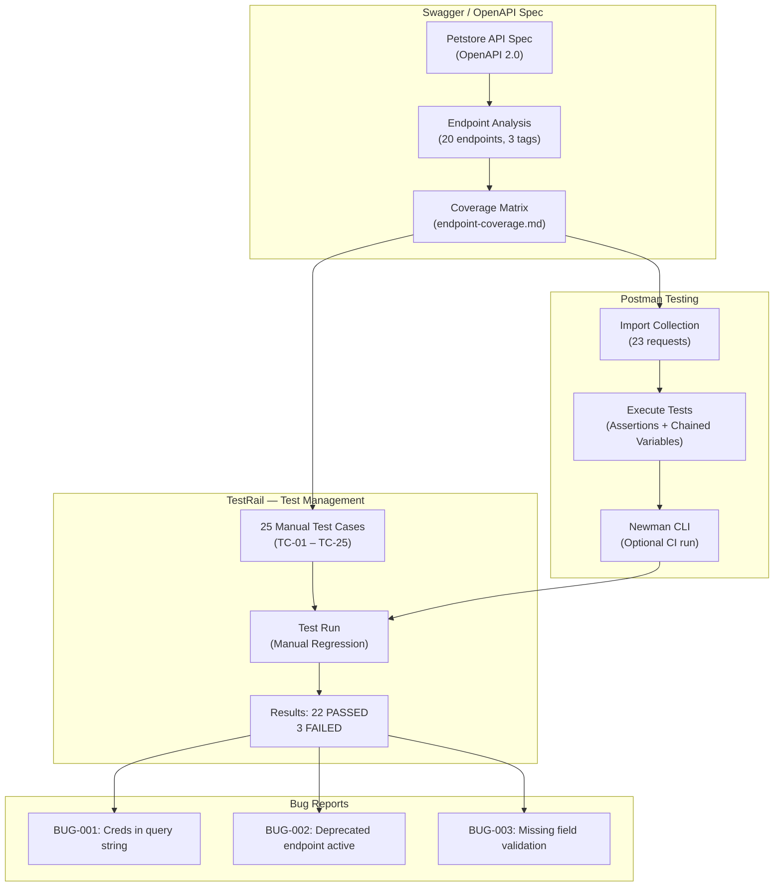

# Swagger + Postman + TestRail — Manual API Testing

Manual API testing of the [Swagger Petstore](https://petstore.swagger.io/) using Postman, with test cases managed in TestRail. This project demonstrates the full manual QA workflow — from reading an OpenAPI spec, to writing and executing test cases in Postman, to tracking results in TestRail and filing bug reports.

---

## What This Project Does



---

## Directory Structure

**`swagger-postman-testrail-manual/`**

| Path | Description |
|------|-------------|
| **swagger/** | |
| ├── [petstore-api-spec.json](swagger/petstore-api-spec.json) | Petstore OpenAPI 2.0 spec (reference copy) |
| └── [endpoint-coverage.md](swagger/endpoint-coverage.md) | Full endpoint coverage matrix with observations |
| **postman/** | |
| ├── **collections/** | |
| │ └── [Petstore-API-Tests.postman_collection.json](postman/collections/Petstore-API-Tests.postman_collection.json) | 23 requests with test scripts across Pet, Store, User |
| ├── **environments/** | |
| │ └── [Petstore-Dev.postman_environment.json](postman/environments/Petstore-Dev.postman_environment.json) | Dev environment (base URL, API key, dynamic variables) |
| └── **newman-reports/** | Newman CLI HTML reports (generated on demand) |
| **testrail/** | |
| ├── **test-cases/** | |
| │ └── [petstore-manual-test-cases.csv](testrail/test-cases/petstore-manual-test-cases.csv) | 25 test cases in TestRail CSV import format |
| └── **test-plan/** | |
| │ └── [test-plan.md](testrail/test-plan/test-plan.md) | Milestone, test plan, test run details |
| **bug-reports/** | |
| └── [bug-reports.md](bug-reports/bug-reports.md) | 3 defects found during manual testing |
| **artifacts/** | |
| └── *(screenshots from Postman, Swagger UI, TestRail — to be added)* | |

---

## API Under Test

| Field | Value |
|-------|-------|
| **API** | [Swagger Petstore](https://petstore.swagger.io/) |
| **Spec** | OpenAPI 2.0 (Swagger) |
| **Base URL** | `https://petstore.swagger.io/v2` |
| **Endpoints** | 20 across 3 tags |
| **Auth** | API Key (header: `api_key`) |

---

## Test Coverage

25 test cases covering all 20 endpoints — positive flows, negative tests, and boundary conditions:

| Section | Cases | IDs | Type |
|---------|-------|-----|------|
| **Pet** (positive) | 8 | TC-01 – TC-08 | Functional |
| **Store** (positive) | 4 | TC-09 – TC-12 | Functional |
| **User** (positive) | 8 | TC-13 – TC-20 | Functional |
| **Negative tests** | 5 | TC-21 – TC-25 | Negative |

**Results**: 22/25 PASSED — 3 failures traced to API bugs (see [Bug Reports](bug-reports/bug-reports.md))

---

## Tech Stack

| Component | Technology |
|-----------|-----------|
| API Spec | Swagger / OpenAPI 2.0 |
| API Client | Postman (manual execution + test scripts) |
| CLI Runner | Newman (Postman command-line runner) |
| Test Management | TestRail |
| Target API | [Swagger Petstore](https://petstore.swagger.io/) |
| Bug Tracking | Documented in Markdown (simulating Jira-style reports) |

---

## How the Workflow Works

1. **Analyze the API spec** — review the Swagger/OpenAPI definition, map all endpoints, note data models, auth, and deprecation flags
2. **Write test cases** — create 25 manual test cases in TestRail CSV format covering positive, negative, and boundary scenarios
3. **Build the Postman collection** — 23 requests with chained variables (petId, orderId, username flow between requests), pre/post test scripts, and assertions
4. **Execute tests** — run the collection manually in Postman or via Newman CLI
5. **Record results in TestRail** — update the test run with PASS/FAIL per case
6. **File bug reports** — document any defects found with steps to reproduce, expected vs. actual, severity, and impact

---

## Postman Collection Details

The collection contains **23 requests** organized into 3 folders:

### Pet (9 requests)
Add pet → Get pet → Update pet (PUT) → Find by status → Find by tags → Update with form data → Delete pet → Get deleted pet (404) → Get invalid ID (400/404)

### Store (5 requests)
Get inventory → Place order → Find order → Delete order → Find invalid order (404)

### User (9 requests)
Create user → Create with array → Create with list → Login → Get user → Update user → Logout → Delete user → Get deleted user (404)

**Key features**:
- **Chained variables**: `petId`, `orderId`, and `username` are set dynamically from POST responses and used in subsequent requests
- **Test scripts**: Every request has `pm.test()` assertions checking status codes, response body fields, and data types
- **Negative tests**: Invalid IDs, deleted resources, and missing required fields
- **Environment file**: Externalizes `baseUrl` and `apiKey` for easy switching between environments

---

## Bug Reports Summary

3 defects found during manual testing:

| Bug | Severity | Endpoint | Category |
|-----|----------|----------|----------|
| [BUG-001](bug-reports/bug-reports.md#bug-001-password-exposed-in-query-string-on-login-endpoint) | High | `GET /user/login` | Security — credentials in URL |
| [BUG-002](bug-reports/bug-reports.md#bug-002-deprecated-endpoint-returns-data-with-no-deprecation-warning) | Low | `GET /pet/findByTags` | API Standards — missing deprecation headers |
| [BUG-003](bug-reports/bug-reports.md#bug-003-missing-server-side-validation-for-required-fields-on-post-pet) | Medium | `POST /pet` | Validation — required field not enforced |

---

## How to Run

### In Postman (GUI)

1. Import the collection: `postman/collections/Petstore-API-Tests.postman_collection.json`
2. Import the environment: `postman/environments/Petstore-Dev.postman_environment.json`
3. Select **Petstore — Dev** environment
4. Run the collection using the Collection Runner (run in order — requests are chained)

### With Newman (CLI)

```bash
npm install -g newman newman-reporter-html

newman run postman/collections/Petstore-API-Tests.postman_collection.json \
  -e postman/environments/Petstore-Dev.postman_environment.json \
  --reporters cli,html \
  --reporter-html-export postman/newman-reports/petstore-report.html
```

---

## Swagger / OpenAPI Observations

Key findings from the spec analysis (full details in [endpoint-coverage.md](swagger/endpoint-coverage.md)):

1. **Security**: Login passes credentials as query parameters instead of request body
2. **No pagination**: `findByStatus` and `findByTags` return unbounded arrays
3. **Deprecated but live**: `findByTags` is deprecated in spec but fully functional with no sunset signal
4. **Missing validation**: Required fields (`name`, `photoUrls`) not enforced server-side
5. **Inconsistent errors**: Some endpoints return structured JSON errors, others return plain text

---

## Related

- **[testrail-automation-integration/](../testrail-automation-integration/)** — Automated test result reporting from Cucumber/Playwright to TestRail via Jenkins CI/CD

---

## Author

**Jigyasa Gupta** — QA Engineer
[GitHub](https://github.com/jgupta-git)
