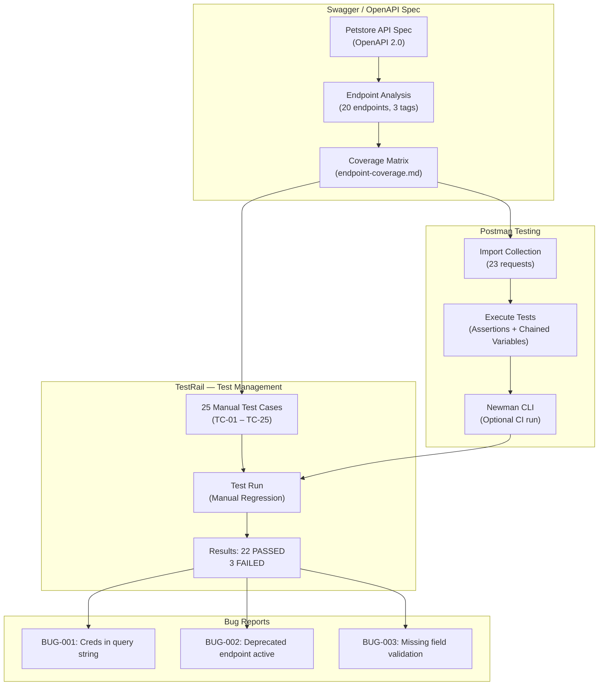
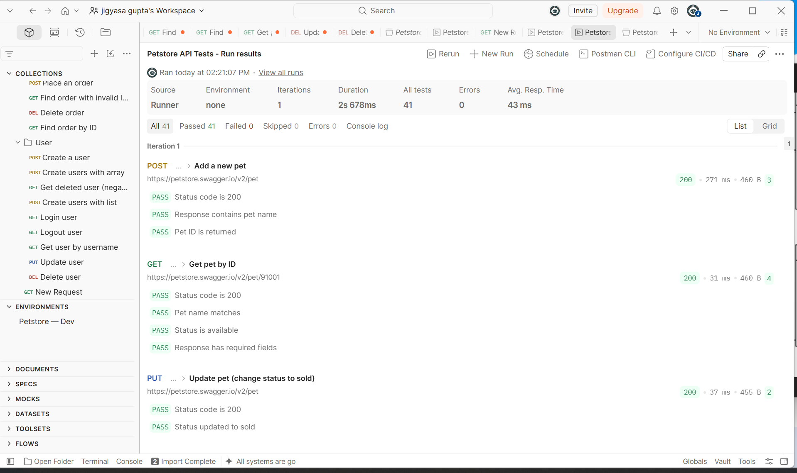

# Swagger + Postman + TestRail — Manual API Testing

Manual API testing of the [Swagger Petstore](https://petstore.swagger.io/) using Postman, with test cases managed in TestRail. This project demonstrates the full manual QA workflow — from reading an OpenAPI spec, to writing and executing test cases in Postman, to tracking results in TestRail and filing bug reports.

---

## What This Project Does



---

## Directory Structure

**`swagger-postman-testrail-manual/`**

| Path | Description |
|------|-------------|
| **swagger/** | |
| ├── [petstore-api-spec.json](swagger/petstore-api-spec.json) | Petstore OpenAPI 2.0 spec (reference copy) |
| └── [endpoint-coverage.md](swagger/endpoint-coverage.md) | Full endpoint coverage matrix with observations |
| **postman/** | |
| ├── **collections/** | |
| │ └── [Petstore-API-Tests.postman_collection.json](postman/collections/Petstore-API-Tests.postman_collection.json) | 23 requests with test scripts across Pet, Store, User |
| ├── **environments/** | |
| │ └── [Petstore-Dev.postman_environment.json](postman/environments/Petstore-Dev.postman_environment.json) | Dev environment (base URL, API key, dynamic variables) |
| └── **newman-reports/** | Newman CLI HTML reports (generated on demand) |
| **testrail/** | |
| ├── **test-cases/** | |
| │ ├── [pet-test-cases.csv](testrail/test-cases/pet-test-cases.csv) | 8 Pet section test cases (TestRail CSV import) |
| │ ├── [store-test-cases.csv](testrail/test-cases/store-test-cases.csv) | 4 Store section test cases |
| │ ├── [user-test-cases.csv](testrail/test-cases/user-test-cases.csv) | 8 User section test cases |
| │ └── [negative-test-cases.csv](testrail/test-cases/negative-test-cases.csv) | 5 Negative test cases |
| └── **test-plan/** | |
| │ └── [test-plan.md](testrail/test-plan/test-plan.md) | Milestone, test plan, test run details |
| **bug-reports/** | |
| └── [bug-reports.md](bug-reports/bug-reports.md) | 3 defects found during manual testing |
| **artifacts/** | |
| ├── [postman-collection-runner-results.png](artifacts/postman-collection-runner-results.png) | Postman Collection Runner — all 23 requests executed |
| ├── [testrail-tc01-add-pet-passed.pdf](artifacts/testrail-tc01-add-pet-passed.pdf) | TC-01 Add a new pet (Passed) |
| ├── [testrail-tc02-update-pet.pdf](artifacts/testrail-tc02-update-pet.pdf) | TC-02 Update an existing pet (Passed) |
| ├── [testrail-tc03-find-by-status.pdf](artifacts/testrail-tc03-find-by-status.pdf) | TC-03 Find pets by status (Passed) |
| ├── [testrail-tc04-find-by-tags-bug002.pdf](artifacts/testrail-tc04-find-by-tags-bug002.pdf) | TC-04 Find by tags — BUG-002 (Failed) |
| ├── [testrail-tc05-get-pet-by-id.pdf](artifacts/testrail-tc05-get-pet-by-id.pdf) | TC-05 Get pet by valid ID (Passed) |
| ├── [testrail-tc06-update-form-data.pdf](artifacts/testrail-tc06-update-form-data.pdf) | TC-06 Update pet with form data (Passed) |
| ├── [testrail-tc07-delete-pet.pdf](artifacts/testrail-tc07-delete-pet.pdf) | TC-07 Delete a pet (Passed) |
| ├── [testrail-tc09-get-inventory.pdf](artifacts/testrail-tc09-get-inventory.pdf) | TC-09 Get store inventory (Passed) |
| ├── [testrail-tc10-place-order.pdf](artifacts/testrail-tc10-place-order.pdf) | TC-10 Place an order (Passed) |
| ├── [testrail-tc11-find-order.pdf](artifacts/testrail-tc11-find-order.pdf) | TC-11 Find order by valid ID (Passed) |
| ├── [testrail-tc12-delete-order.pdf](artifacts/testrail-tc12-delete-order.pdf) | TC-12 Delete an order (Passed) |
| ├── [testrail-tc13-create-user.pdf](artifacts/testrail-tc13-create-user.pdf) | TC-13 Create a single user (Passed) |
| ├── [testrail-tc14-create-with-array.pdf](artifacts/testrail-tc14-create-with-array.pdf) | TC-14 Create users with array (Passed) |
| ├── [testrail-tc15-create-with-list.pdf](artifacts/testrail-tc15-create-with-list.pdf) | TC-15 Create users with list (Passed) |
| ├── [testrail-tc16-login-bug001.pdf](artifacts/testrail-tc16-login-bug001.pdf) | TC-16 Login — BUG-001 (Failed) |
| ├── [testrail-tc17-logout.pdf](artifacts/testrail-tc17-logout.pdf) | TC-17 Logout user (Passed) |
| ├── [testrail-tc18-get-user.pdf](artifacts/testrail-tc18-get-user.pdf) | TC-18 Get user by username (Passed) |
| ├── [testrail-tc19-update-user.pdf](artifacts/testrail-tc19-update-user.pdf) | TC-19 Update user (Passed) |
| ├── [testrail-tc20-delete-user.pdf](artifacts/testrail-tc20-delete-user.pdf) | TC-20 Delete user (Passed) |
| ├── [testrail-tc21-invalid-pet-id.pdf](artifacts/testrail-tc21-invalid-pet-id.pdf) | TC-21 Get pet with invalid ID — negative (Passed) |
| ├── [testrail-tc22-deleted-pet-404.pdf](artifacts/testrail-tc22-deleted-pet-404.pdf) | TC-22 Get deleted pet — negative (Passed) |
| ├── [testrail-tc23-invalid-order-id.pdf](artifacts/testrail-tc23-invalid-order-id.pdf) | TC-23 Find order with out-of-range ID — negative (Passed) |
| ├── [testrail-tc24-deleted-user-404.pdf](artifacts/testrail-tc24-deleted-user-404.pdf) | TC-24 Get deleted user — negative (Passed) |
| └── [testrail-tc25-missing-field-bug003.pdf](artifacts/testrail-tc25-missing-field-bug003.pdf) | TC-25 Missing field validation — BUG-003 (Failed) |

---

## API Under Test

| Field | Value |
|-------|-------|
| **API** | [Swagger Petstore](https://petstore.swagger.io/) |
| **Spec** | OpenAPI 2.0 (Swagger) |
| **Base URL** | `https://petstore.swagger.io/v2` |
| **Endpoints** | 20 across 3 tags |
| **Auth** | API Key (header: `api_key`) |

---

## Test Coverage

25 test cases covering all 20 endpoints — positive flows, negative tests, and boundary conditions:

| Section | Cases | IDs | Type |
|---------|-------|-----|------|
| **Pet** (positive) | 8 | TC-01 – TC-08 | Functional |
| **Store** (positive) | 4 | TC-09 – TC-12 | Functional |
| **User** (positive) | 8 | TC-13 – TC-20 | Functional |
| **Negative tests** | 5 | TC-21 – TC-25 | Negative |

**Results**: 22/25 PASSED — 3 failures traced to API bugs (see [Bug Reports](bug-reports/bug-reports.md))

---

## Tech Stack

| Component | Technology |
|-----------|-----------|
| API Spec | Swagger / OpenAPI 2.0 |
| API Client | Postman (manual execution + test scripts) |
| CLI Runner | Newman (Postman command-line runner) |
| Test Management | TestRail |
| Target API | [Swagger Petstore](https://petstore.swagger.io/) |
| Bug Tracking | Documented in Markdown (simulating Jira-style reports) |

---

## How the Workflow Works

1. **Analyze the API spec** — review the Swagger/OpenAPI definition, map all endpoints, note data models, auth, and deprecation flags
2. **Write test cases** — create 25 manual test cases in TestRail CSV format covering positive, negative, and boundary scenarios
3. **Build the Postman collection** — 23 requests with chained variables (petId, orderId, username flow between requests), pre/post test scripts, and assertions
4. **Execute tests** — run the collection manually in Postman or via Newman CLI
5. **Record results in TestRail** — update the test run with PASS/FAIL per case
6. **File bug reports** — document any defects found with steps to reproduce, expected vs. actual, severity, and impact

---

## Postman Collection Details

The collection contains **23 requests** organized into 3 folders:

### Pet (9 requests)
Add pet → Get pet → Update pet (PUT) → Find by status → Find by tags → Update with form data → Delete pet → Get deleted pet (404) → Get invalid ID (400/404)

### Store (5 requests)
Get inventory → Place order → Find order → Delete order → Find invalid order (404)

### User (9 requests)
Create user → Create with array → Create with list → Login → Get user → Update user → Logout → Delete user → Get deleted user (404)

**Key features**:
- **Chained variables**: `petId`, `orderId`, and `username` are set dynamically from POST responses and used in subsequent requests
- **Test scripts**: Every request has `pm.test()` assertions checking status codes, response body fields, and data types
- **Negative tests**: Invalid IDs, deleted resources, and missing required fields
- **Environment file**: Externalizes `baseUrl` and `apiKey` for easy switching between environments

---

## Bug Reports Summary

3 defects found during manual testing:

| Bug | Severity | Endpoint | Category |
|-----|----------|----------|----------|
| [BUG-001](bug-reports/bug-reports.md#bug-001-password-exposed-in-query-string-on-login-endpoint) | High | `GET /user/login` | Security — credentials in URL |
| [BUG-002](bug-reports/bug-reports.md#bug-002-deprecated-endpoint-returns-data-with-no-deprecation-warning) | Low | `GET /pet/findByTags` | API Standards — missing deprecation headers |
| [BUG-003](bug-reports/bug-reports.md#bug-003-missing-server-side-validation-for-required-fields-on-post-pet) | Medium | `POST /pet` | Validation — required field not enforced |

---

## How to Run

### In Postman (GUI)

1. Import the collection: `postman/collections/Petstore-API-Tests.postman_collection.json`
2. Import the environment: `postman/environments/Petstore-Dev.postman_environment.json`
3. Select **Petstore — Dev** environment
4. Run the collection using the Collection Runner (run in order — requests are chained)

### With Newman (CLI)

```bash
npm install -g newman newman-reporter-html

newman run postman/collections/Petstore-API-Tests.postman_collection.json \
  -e postman/environments/Petstore-Dev.postman_environment.json \
  --reporters cli,html \
  --reporter-html-export postman/newman-reports/petstore-report.html
```

---

## Swagger / OpenAPI Observations

Key findings from the spec analysis (full details in [endpoint-coverage.md](swagger/endpoint-coverage.md)):

1. **Security**: Login passes credentials as query parameters instead of request body
2. **No pagination**: `findByStatus` and `findByTags` return unbounded arrays
3. **Deprecated but live**: `findByTags` is deprecated in spec but fully functional with no sunset signal
4. **Missing validation**: Required fields (`name`, `photoUrls`) not enforced server-side
5. **Inconsistent errors**: Some endpoints return structured JSON errors, others return plain text

---

## Artifacts & Screenshots

### Postman Collection Runner

| Screenshot | Description |
|------------|-------------|
|  | **Postman Collection Runner** — All 23 requests executed, 41 test assertions passed |

### TestRail Test Case Results (24 of 25 cases — TC-08 excluded, no image upload in test run)

| Case | Test Case | Result | Notes |
|------|-----------|--------|-------|
| [TC-01](artifacts/testrail-tc01-add-pet-passed.pdf) | Add a new pet — valid payload | ✅ Passed | |
| [TC-02](artifacts/testrail-tc02-update-pet.pdf) | Update an existing pet | ✅ Passed | |
| [TC-03](artifacts/testrail-tc03-find-by-status.pdf) | Find pets by status — available | ✅ Passed | |
| [TC-04](artifacts/testrail-tc04-find-by-tags-bug002.pdf) | Find pets by tags (deprecated) | ❌ Failed | BUG-002: No deprecation header |
| [TC-05](artifacts/testrail-tc05-get-pet-by-id.pdf) | Get pet by valid ID | ✅ Passed | |
| [TC-06](artifacts/testrail-tc06-update-form-data.pdf) | Update pet with form data | ✅ Passed | |
| [TC-07](artifacts/testrail-tc07-delete-pet.pdf) | Delete a pet | ✅ Passed | |
| [TC-09](artifacts/testrail-tc09-get-inventory.pdf) | Get store inventory | ✅ Passed | |
| [TC-10](artifacts/testrail-tc10-place-order.pdf) | Place an order — valid payload | ✅ Passed | |
| [TC-11](artifacts/testrail-tc11-find-order.pdf) | Find order by valid ID | ✅ Passed | |
| [TC-12](artifacts/testrail-tc12-delete-order.pdf) | Delete an order | ✅ Passed | |
| [TC-13](artifacts/testrail-tc13-create-user.pdf) | Create a single user | ✅ Passed | |
| [TC-14](artifacts/testrail-tc14-create-with-array.pdf) | Create users with array | ✅ Passed | |
| [TC-15](artifacts/testrail-tc15-create-with-list.pdf) | Create users with list | ✅ Passed | |
| [TC-16](artifacts/testrail-tc16-login-bug001.pdf) | Login — valid credentials | ❌ Failed | BUG-001: Password in query string |
| [TC-17](artifacts/testrail-tc17-logout.pdf) | Logout user | ✅ Passed | |
| [TC-18](artifacts/testrail-tc18-get-user.pdf) | Get user by username | ✅ Passed | |
| [TC-19](artifacts/testrail-tc19-update-user.pdf) | Update user | ✅ Passed | |
| [TC-20](artifacts/testrail-tc20-delete-user.pdf) | Delete user | ✅ Passed | |
| [TC-21](artifacts/testrail-tc21-invalid-pet-id.pdf) | Get pet with invalid ID (negative) | ✅ Passed | |
| [TC-22](artifacts/testrail-tc22-deleted-pet-404.pdf) | Get deleted pet (negative) | ✅ Passed | Confirms 404 after deletion |
| [TC-23](artifacts/testrail-tc23-invalid-order-id.pdf) | Find order with out-of-range ID (negative) | ✅ Passed | |
| [TC-24](artifacts/testrail-tc24-deleted-user-404.pdf) | Get deleted user (negative) | ✅ Passed | |
| [TC-25](artifacts/testrail-tc25-missing-field-bug003.pdf) | Add pet without required field (negative) | ❌ Failed | BUG-003: Missing field validation |

---

## Related

- **[testrail-automation-integration/](../testrail-automation-integration/)** — Automated test result reporting from Cucumber/Playwright to TestRail via Jenkins CI/CD

---

## Author

**Jigyasa Gupta** — QA Engineer
[GitHub](https://github.com/jgupta-git)
