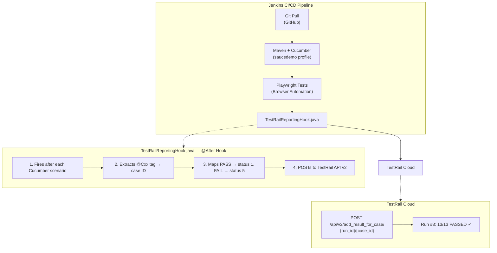

# TestRail Automation Integration

Automated test result reporting from a Cucumber/Playwright test suite to TestRail, triggered by Jenkins CI/CD. This project demonstrates how to close the loop between test execution and test management — every Cucumber scenario posts its PASS/FAIL status to TestRail in real time, eliminating manual result entry.

---

## What This Project Does



---

## Directory Structure

**`testrail-automation-integration/`**

| Path | Description |
|------|-------------|
| **artifacts/** | |
| ├── [milestone_activity.png](artifacts/milestone_activity.png) | Milestone timeline — all 13 tests posted automatically |
| ├── [milestone_status.png](artifacts/milestone_status.png) | Pie chart — 100% pass rate |
| ├── [milestones.png](artifacts/milestones.png) | Milestones overview |
| ├── [project_overview.png](artifacts/project_overview.png) | TestRail project dashboard |
| ├── [single_test_case.png](artifacts/single_test_case.png) | Test case C2 detail view |
| ├── [testcases.png](artifacts/testcases.png) | All 6 sections, C2–C14 |
| └── [testrun_report.png](artifacts/testrun_report.png) | Run results — 13/13 PASSED |
| **automation-integration-files/** | |
| ├── [TestRailReportingHook.java](automation-integration-files/TestRailReportingHook.java) | Cucumber `@After` hook (posts results to TestRail) |
| └── [jenkins-config.md](automation-integration-files/jenkins-config.md) | Jenkins freestyle job configuration docs |
| **test-cases/** | |
| ├── [saucedemo-test-cases.csv](test-cases/saucedemo-test-cases.csv) | All 13 test cases exported from TestRail |
| └── [test-plan.md](test-cases/test-plan.md) | Milestone, test plan, and test run details |
| **reports/** | |
| ├── [Regression & Smoke - TestRail.pdf](reports/Regression%20%26%20Smoke%20-%20TestRail.pdf) | TestRail run report (PDF export) |
| └── [testrail-milestone-report.pdf](reports/testrail-milestone-report.pdf) | Milestone report — SauceDemo v1.0 UAT Ready (100% pass rate) |

---

## Test Coverage

13 test cases across 6 sections, all automated with Cucumber/Playwright:

| Section | Cases | IDs | What It Tests |
|---------|-------|-----|---------------|
| **Login** | 4 | C2–C5 | Valid login, locked-out user, empty/invalid username, empty/wrong password |
| **PDF Receipt** | 1 | C6 | Checkout totals match between on-screen and downloaded PDF |
| **Product Image Integrity** | 2 | C7–C8 | Unique images for standard_user; broken images for problem_user |
| **Product Sort** | 2 | C9–C10 | Price sort works for standard_user; broken sort for problem_user |
| **Session Management** | 2 | C11–C12 | Reset App State clears cart; logout blocks back-button access |
| **Visual Regression** | 2 | C13–C14 | Pixel-diff baseline check; visual_user renders differently |

---

## Tech Stack

| Component | Technology |
|-----------|-----------|
| Application Under Test | [SauceDemo](https://www.saucedemo.com/) |
| Test Framework | Cucumber 7.x (BDD / Gherkin) |
| Browser Automation | Playwright (Java) |
| Build Tool | Maven (`saucedemo` profile) |
| CI/CD | Jenkins (freestyle job: `saucedemo_run`) |
| Test Management | TestRail (cloud instance) |
| Reporting Hook | Custom Java `@After` hook via TestRail API v2 |
| Language | Java |

---

## How the Integration Works

1. **Jenkins** pulls the latest code from GitHub and runs Maven with the `saucedemo` profile
2. **Cucumber** executes each `.feature` file; **Playwright** drives the browser
3. After each scenario, the **`@After` hook** (`TestRailReportingHook.java`) fires
4. The hook reads the **`@Cxx` tag** on the scenario (e.g., `@C2`) to get the TestRail case ID
5. It determines the result: `status_id = 1` (passed) or `status_id = 5` (failed)
6. It **POSTs** to the TestRail API:
   ```
   POST {TESTRAIL_URL}/index.php?/api/v2/add_result_for_case/{run_id}/{case_id}
   ```
7. **TestRail** updates the test run dashboard — no manual entry needed

---

## Key Technical Details

### TestRail API Endpoint

The `add_result_for_case` endpoint takes **two** path parameters — `{run_id}` and `{case_id}`. There is no project ID in the URL.

```
POST /index.php?/api/v2/add_result_for_case/{run_id}/{case_id}

Body: { "status_id": 1, "comment": "Test passed" }

Auth: Basic (email:api_key)
```

### Configuration Sources

The hook reads config from two sources, with system properties taking priority:

```
System.getProperty(key)  →  Maven -D flags (highest priority)
System.getenv(key)       →  OS environment variables (fallback)
```

This design lets Jenkins pass most values as Maven flags while keeping the **API key secure** through Jenkins Credential Binding (environment variable only — never in build logs).

### Jenkins Build Parameters

| Parameter | Description |
|-----------|-------------|
| `TESTRAIL_URL` | TestRail instance URL (no trailing slash) |
| `TESTRAIL_USER` | Login email |
| `TESTRAIL_API_KEY` | API key — bound via Jenkins Credentials, never as `-D` flag |
| `TESTRAIL_RUN_ID` | Active test run ID |
| `TESTRAIL_ENABLED` | Set `false` to skip posting |

---

## TestRail Screenshots

Since the TestRail instance is a 30-day trial (`testingdemoforinterview.testrail.io`), screenshots are preserved in the [`artifacts/`](artifacts/) directory for reference:

| Screenshot | What It Shows |
|------------|---------------|
| [Project Overview](artifacts/project_overview.png) | TestRail project dashboard — activity feed, milestones, and test runs at a glance |
| [Milestones](artifacts/milestones.png) | Milestones list with "SauceDemo v1.0 — UAT Ready" at 100% completion |
| [Milestone Status](artifacts/milestone_status.png) | Pie chart breakdown — 13 Passed / 0 Failed (100% pass rate) |
| [Milestone Activity](artifacts/milestone_activity.png) | Timeline showing all 13 test results posted automatically during the Jenkins build |
| [Test Cases](artifacts/testcases.png) | All 6 sections (Login, PDF Receipt, Product Image Integrity, Product Sort, Session Management, Visual Regression) with cases C2–C14 |
| [Test Case Detail (C2)](artifacts/single_test_case.png) | Individual test case view — Type: Functional, Priority: High, Is Automated: Yes |
| [Test Run Report](artifacts/testrun_report.png) | "Regression & Smoke" run results — all 13 cases PASSED with automated comments |

---

## Reports

Test run reports exported from TestRail are in the [`reports/`](reports/) directory:

- [Regression & Smoke - TestRail.pdf](reports/Regression%20%26%20Smoke%20-%20TestRail.pdf) — Run summary with pass/fail status per test case, coverage by section, and execution timeline
- [testrail-milestone-report.pdf](reports/testrail-milestone-report.pdf) — Overall milestone report: SauceDemo v1.0 — UAT Ready (100% pass rate, 13/13 cases)

> **Note**: Reports are PDF exports from the TestRail cloud instance.

---

## Results

**TestRail Run #3**: 13/13 test cases **PASSED** (100%)

All results were posted automatically by the Cucumber `@After` hook during a Jenkins build — zero manual entry.

---

## Related Repositories

- **[saucedemo-qa-portfolio](https://github.com/jgupta-git/saucedemo-qa-portfolio)** — The full Cucumber/Playwright test suite that this integration reports from

---

## Author

**Jigyasa Gupta** — QA Engineer  
[GitHub](https://github.com/jgupta-git)
